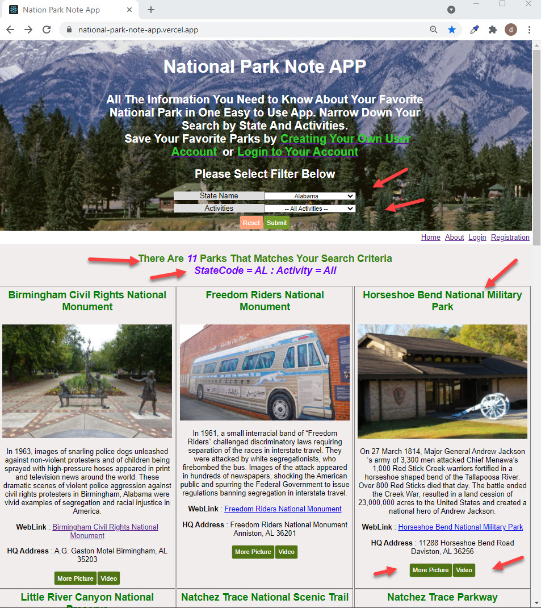

# National Park Note APP - Database Version - Server/API


# Project Summary:

This <b>Capstone Project</b> project converts the data store for <b>National Park Note APP</b> [Memory Store Version](https://github.com/davetam88/National-Park-Note-App) into a set of API endpoints with PostgreSQL as the database engine. These endpoints were used extensively by the  <b>National Park Note APP - Client</b> [Database Version](https://github.com/davetam88/Nation-Park-Note-App-Client), an online version of this client app hosted by [Vercel](https://vercel.com) can be launch [here](https://national-park-note-app-client.vercel.app/). This API endpoint server was deployed onliine and is hosted by [Heroku](https://heroku.com).


# Project Links
- [GitHub Code Link - Database Version - Server](https://github.com/davetam88/Nation-Park-Note-App-Server)

- [GitHub Code Link - Database Version - Client](https://github.com/davetam88/Nation-Park-Note-App-Client)

- [GitHub Code Link - Memory Store Version](https://github.com/davetam88/National-Park-Note-App)

- [Live Demo Link - Vercel](https://national-park-note-app-client.vercel.app/)


# Endpoints:
  ENDPOINTS                     | FUNCTION
  ------------------------------|----------------------------------------------------------
  GET /api/users                | read all the user information in the database
  GET /api/users/id             | Read a single user record indexed by the user id.
  GET /api/favparks             | Read all the favparks stored in the database
  GET /api/favparks/id          | Read a single favpark record indexed by the favpark id.
  GET /api/favparks/favparks-userid/id | Returns all the favparks saved by user index by user id.
  DELETE /api/users/id          | Delete a single user record indexed by the user id.
  DELETE /api/favparks/id       | Delete a single favpark record indexed by the favpark id.
  POST /api/user                | Create a new user record
  POST /api/favpark             | Create a new favpark record
<br>

# API Code Snippet Screenshot:

## Code Snippet <<<


## Client App Home Page <<<



## >> Technologies used in this APP:
```
* Heroku 
* Express framework - for building Node web APIs.
* PostgreSQL database
* morgan - HTTP request logger.
* Express middleware
* API tokens
* CORS - an Express middleware, it simplifies the configuration of CORS in Express.
* Helmet
* Supertest library - 

-> Javascript: ES6

-> Tools
* Postman
* VSC Debugger
* nodemon 
* NPM
* Dbeaver
* morgan loggging tool
```

## Author

* David Tam - Full Stack Developer
* Contact - <davetam88@gmail.com> 

